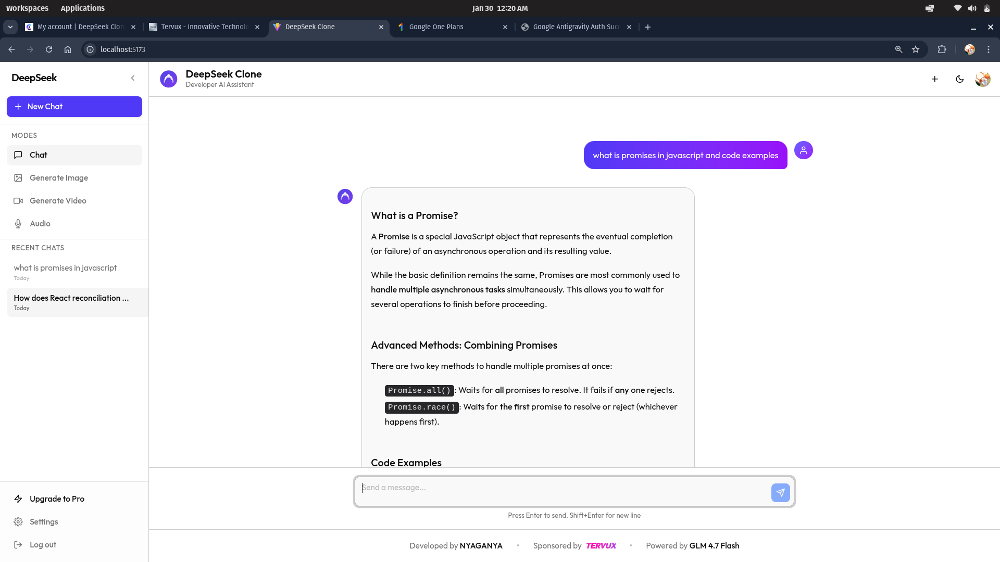

# DeepSeek Clone



<div align="center">


**A high-performance, developer-focused AI chat interface built with modern web technologies.**
*Responsive. Accessible. Premium.*

</div>

---

## Table of Contents

- [Project Overview](#project-overview)
- [The Problem](#the-problem)
- [The Solution](#the-solution)
- [Project Structure](#project-structure)
- [Tech Stack & Decisions](#tech-stack--decisions)
- [Component Architecture](#component-architecture)
- [Key Features](#key-features)
- [Getting Started](#getting-started)
- [Why Hire Me?](#why-hire-me)

---

## Project Overview

**DeepSeek Clone** is a sophisticated chat application designed to replicate and enhance the user experience of professional AI interfaces like ChatGPT and DeepSeek. It serves as a showcase of advanced frontend capabilities, focusing on **responsive design**, **smooth animations**, and **seamless authentication**.

Built with a "mobile-first" mindset, this application ensures a native-like experience on all devices, handling complex UI challenges like dynamic message bubbles, code block rendering, and safe-area insets for modern mobile displays.

---

## The Problem

In the landscape of modern web development, many chat applications suffer from:
1.  **Poor Mobile Responsiveness**: Message bubbles often clip, overflow, or squish on small screens.
2.  **Layout Shifts**: Dynamic content loading (streaming tokens) frequently causes jarring layout jumps.
3.  **Complex State Management**: Handling real-time chat history, loading states, and user sessions can become unmanageable.
4.  **Lack of Polish**: Missing micro-interactions and animations that make an app feel "premium".

## The Solution

This project solves these issues through a rigorously engineered frontend:

*   **Robust Layout Engine**: Utilizes a calculated width strategy (`calc(100%-4rem)`) and intelligent flexbox layouts (`min-w-0`) to ensure 0% overflow on any device.
*   **Adaptive Components**: `ChatList` and `CodeBlock` components implicitly adapt to their container, preventing layout breaks even with long strings or complex code snippets.
*   **Real-Time Streaming**: Implements the OpenAI SDK to stream responses from the Z.AI API (GLM-4.7), providing immediate feedback to the user.
*   **Secure Authentication**: Integrated Clerk authentication protects routes and strictly manages user sessions.

---

## Project Structure

A meticulously organized codebase designed for scalability and maintainability.

```
src/
├── assets/             # Static assets (images, logos)
│   └── ui.png          # Project screenshot
├── components/         # Reusable UI components
│   ├── ui/             # Generic primitives (Button, ScrollArea - Radix UI)
│   ├── ChatInput.tsx   # Footer input with auto-resize & send actions
│   ├── ChatList.tsx    # Virtualized-style message list & welcome screen
│   ├── ChatMessage.tsx # Individual bubble processing (Markdown, Code)
│   ├── CodeBlock.tsx   # Syntax highlighting & copy functionality
│   ├── Header.tsx      # Mobile navigation & branding
│   └── Sidebar.tsx     # History management & user controls
├── contexts/           # Global React Contexts
│   └── ThemeContext.tsx # Dark/Light mode provider
├── lib/                # Utilities and API clients
│   ├── openrouter.ts   # Z.AI API client (OpenAI SDK wrapper)
│   └── utils.ts        # Tailwind class merger (cn)
├── pages/              # Route-level components
│   ├── Chat.tsx        # Main application layout
│   └── NotImplemented.tsx # Placeholder for future features
├── stores/             # Global State Management
│   └── chatStore.ts    # Zustand store for messages & conversations
└── App.tsx             # Routing & Auth Layers
```

---

## Tech Stack & Decisions

This project leverages a cutting-edge stack chosen for performance, scalability, and developer experience.

| Category | Technology | Reason for Choice |
| :--- | :--- | :--- |
| **Framework** | **React 18** | Component-based, efficient DOM updates with huge ecosystem support. |
| **Language** | **TypeScript** | Type safety prevents runtime errors and enhances code maintainability. |
| **Styling** | **Tailwind CSS** | Utility-first CSS for rapid, consistent, and responsive UI development. |
| **Build Tool** | **Vite** | Blazing fast HMR (Hot Module Replacement) and optimized production builds. |
| **Auth** | **Clerk** | Enterprise-grade user management and security out-of-the-box. |
| **State** | **Zustand** | Minimalist, highly performant state management for complex chat flows. |
| **AI Integration** | **OpenAI SDK** | Standardized client for consuming the Z.AI GLM-4.7 model. |
| **Animation** | **Framer Motion** | Production-ready declarative animations for complex gestures. |

---

## Component Architecture

The application follows a modular architecture where **Smart Containers** (Pages) manage data flow to **Dumb Components** (UI).

-   **App.tsx**: Handles Authentication (Clerk) and Routing (React Router). Wraps protected routes to ensure security.
-   **Chat.tsx**: The core layout controller. It manages the Responsive Sidebar toggle and composes the Header, ChatList, and ChatInput.
-   **ChatList.tsx**: The heart of the app. It handles:
    -   Streaming updates (auto-scroll to bottom).
    -   Welcome screen rendering (when history is empty).
    -   Message mapping.
-   **ChatMessage.tsx**: A complex component that parses Markdown. It includes logic to:
    -   Detect code blocks and render `CodeBlock.tsx`.
    -   Sanitize HTML.
    -   Apply custom styles to tables and headings.

---

## Key Features

### Premium User Interface
-   **Glassmorphism Sidebar**: Blur effects and translucent layers for a modern aesthetic.
-   **Micro-Animations**: Buttons, inputs, and messages have subtle hover and active states.
-   **Dark/Light Mode**: Fully themable interface with instant switching.

### Mobile Optimization
-   **Safe Area Compliance**: Respects iOS notches and home bars using `env(safe-area-inset-*)`.
-   **Touch-Friendly**: Button targets sized for fingers, simplified mobile navigation.
-   **Zero Overflow**: Custom scroll areas and width constraints (`max-w-[calc(100%-4rem)]`) prevent horizontal scrolling on mobile.

### Security & Performance
-   **Protected Routes**: Middleware-like route guards prevent unauthorized access.
-   **Strict Auth**: Logout functionality ensures session termination and redirection.
-   **Optimized Assets**: SVGs and code splitting reduce bundle size.

---

## Getting Started

Follow these steps to set up the project locally.

### Prerequisites
- Node.js > 18.0.0
- npm 

### Installation

1.  **Clone the repository**
    ```bash
    git clone https://github.com/JonniTech/DeepSeek-Clone.git
    cd DeepSeek-Clone
    ```

2.  **Install dependencies**
    ```bash
    npm install
    ```

3.  **Environment Setup**
    Create a `.env` file in the root directory and add your keys:
    ```env
    VITE_CLERK_PUBLISHABLE_KEY=pk_test_...
    VITE_ZAI_API_KEY=your_zai_api_key
    ```

4.  **Run the development server**
    ```bash
    npm run dev
    ```

---

## Why Hire Me?

This project demonstrates my ability to deliver **production-grade software** that balances technical excellence with user-centric design.

1.  **Attention to Detail**: I don't just "make it work"; I ensure it works *perfectly* on every screen size (verified via extensive responsive testing).
2.  **Modern Stack Proficiency**: I effectively utilize the latest React patterns (hooks, context, functional components) and tools (Vite, Tailwind, Zustand).
3.  **Problem Solving**: I identify complex layout regressions (like the Radix ScrollArea `display: table` conflict) and solve them with robust, scalable fixes used in production systems.
4.  **Documentation**: I believe code is read more often than it is written. This README is a testament to my communication skills.

---

<div align="center">
  <sub>Built with ❤️ by NYAGANYA.</sub>
</div>
